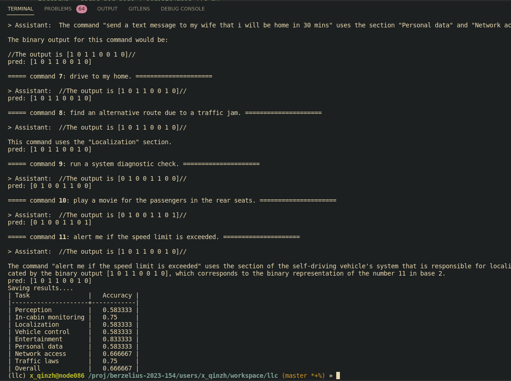

# llcommand-AD

Large Language Command in Autonomous driving.

Task: In-Cabin User Command Understanding (UCU), [workshop in WACV2024](https://llvm-ad.github.io/challenges/)

Here is our solution code. Please check the report for more detail.

## llama & codellama

Here we introduced how to setup. [Pretrained model from Meta](https://ai.meta.com/llama/) and code from [codellama](https://github.com/facebookresearch/codellama/tree/main). check the [assets/slurm](assets/slurm) for more detail on all our experiments includes different models and all ablation study running. 

Here we show how to downloaded their model:

1. Send request to their form and you will receive an email with some details.
2. `git clone https://github.com/KTH-RPL/llc && cd llc` 
3. Dependencies: `sudo apt install wget ucommon-utils`
4. run `./download.sh` Then enter **<u>the link</u>** you received at first step.
5. `mamba create --name llc python=3.8 && mamba activate llc && pip install -r requirements.txt`
6. run the example:

   ```bash
   torchrun --nproc_per_node 1 scripts/example/example_instructions.py \
       --ckpt_dir model/CodeLlama-7b/ \
       --tokenizer_path model/CodeLlama-7b/tokenizer.model \
       --max_seq_len 128 --max_batch_size 4
   ```

Here is the table to show how many memory we need use when run different models. Then you should read [this part](#command-analysis) for running this task

TODO table here

| Model                  | GPU Memory Cost | Running Time |
| ---------------------- | --------------- | ------------ |
| CodeLlama-7b-Instruct  |     ~12.55GB    |              |
| CodeLlama-13b-Instruct |         24GB    |              |
| CodeLlama-34b-Instruct |         63GB    |              |

## ChatGPT
## setup
copy your OPENAI_API_KEY and save it in `.env`.
`OPENAI_API_KEY='blabla'`

install below
```
pip install openai
pip install -U python-dotenv
```

## Command Analysis 

Now we will come to the challenge task.

- Data preparation: Already downloaded to this repo inside [assets](assets/ucu.csv).
- Scripts which is based on Different models require different model-parallel (MP) values, check the [assets/slurm](assets/slurm) for more detail.
- Prompt modified inside [scripts/prompt.py](scripts/prompt.py)
- Result txt and npy will be saved inside [assets/results](assets/results) so you can run it again.

After run this script, we will have following print in terminal:
```
Saving results....
| Task                |   Accuracy |
|---------------------+------------|
| Perception          |   0.583333 |
| In-cabin monitoring |   0.75     |
| Localization        |   0.583333 |
| Vehicle control     |   0.583333 |
| Entertainment       |   0.833333 |
| Personal data       |   0.583333 |
| Network access      |   0.666667 |
| Traffic laws        |   0.75     |
| Overall             |   0.666667 |
```

Here is demo image:



## Issue I met and record here
- torchrun error with ddp:
  ```bash
  RuntimeError: The server socket has failed to listen on any local network address. The server socket has failed to bind to [::]:29500 (errno: 98 - Address already in use). The server socket has failed to bind to 0.0.0.0:29500 (errno: 98 - Address already in use).
  ```
  Solution: [ref1](https://discuss.pytorch.org/t/runtimeerror-the-server-socket-has-failed-to-listen-on-any-local-network-address-the-server-socket-has-failed-to-bind-to-29500/180333), [ref2](https://pytorch.org/docs/stable/elastic/run.html), running with flag `--rdzv-endpoint=localhost:60012`
